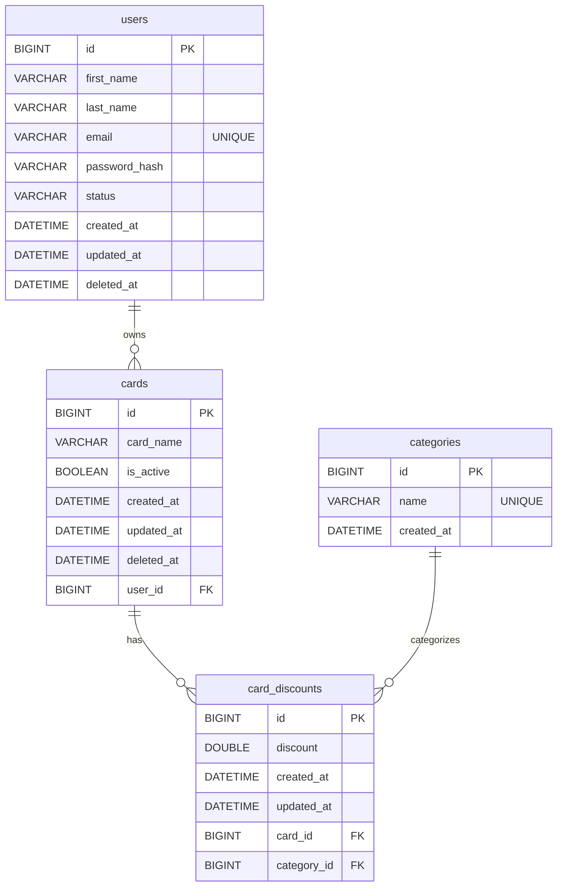

# BestCard

BestCard is a full-stack "best card" tracker for comparing and managing credit card rewards. Users can sign up and log in, then add cards with a rewards category and discount percentage. The dashboard supports searching, editing, and deleting cards, plus a simple "discount tracker" view to visualize reward rates at a glance.

## Tech stack

- Frontend: React, React Router, Axios, Vite
- Backend: Java 21, Spring Boot, Spring Security, Spring WebMVC, Spring Data JPA, MySQL, JJWT

## Repo layout

- `frontend/`: React (Vite) SPA
- `backend/`: Spring Boot REST API (JWT auth) + MySQL (JPA/Hibernate)

## Installation (local dev)

### 1) Backend (Spring Boot + MySQL)

Prereqs:
- Java 21
- MySQL running locally

Create a database:
- Create `bestcard_db` in my local MySQL instance.

Set env vars (used by `backend/src/main/resources/application.properties`):
- `DB_USERNAME`
- `DB_PASSWORD`

Run the API (defaults to `http://localhost:8080`):

```powershell
cd backend
.\mvnw.cmd spring-boot:run
```

### 2) Frontend (Vite)

Prereqs:
- Node.js + npm

Run the UI (defaults to `http://localhost:5173`):

```powershell
cd frontend
npm install
npm run dev
```

## Frontend overview

- Entry: `frontend/src/main.jsx` -> `frontend/src/App.jsx`
- Routing: `react-router-dom`
  - `/` shows `Home` if logged out, otherwise redirects to `/landingA`
  - `/signup`, `/login`, `/landingA`, plus informational pages (`/about`, `/contact`, `/what-is-bestcard`)
- Auth token: stored in `localStorage` under `token`
- API client: `frontend/src/services/api.js`
  - Base URL is hard-coded to `http://localhost:8080/api`
  - Adds `Authorization: Bearer <token>` automatically when present

## Backend overview

- Base package: `com.launchcode.bestcard_api`
- REST endpoints:
  - `POST /api/signup` (public)
  - `POST /api/login` (public)
  - `POST /api/cards` (auth required)
  - `GET /api/cards` (auth required)
  - `PUT /api/cards/{id}` (auth required)
  - `DELETE /api/cards/{id}` (auth required)
- Auth: stateless JWT (Spring Security filter)
  - The token subject is the user email, which is used to look up/own cards
  - Tokens expire after ~1 hour
  - Note: the JWT signing key is generated in-memory on startup (`JwtService`), so restarting the API invalidates old tokens
- CORS: allows `http://localhost:5173`
- Persistence: MySQL via Spring Data JPA (`ddl-auto=update`)

## API request/response shapes (current implementation)

Auth:

- `POST /api/signup`
  - Body: `{ "firstName", "lastName", "email", "password" }`
  - Response: `{ "token": "Signup successful" }`
- `POST /api/login`
  - Body: `{ "email", "password" }`
  - Response: `{ "token": "<jwt>" }`

Cards (requires header `Authorization: Bearer <jwt>`):

- `POST /api/cards`
  - Body: `{ "cardName", "category", "discount" }`
  - Response: `"Card added successfully"`
- `GET /api/cards`
  - Response: `[ { "id", "cardName", "category", "discount" }, ... ]`
- `PUT /api/cards/{id}`
  - Body: `{ "cardName", "category", "discount" }`
  - Response: `"Card updated successfully"`
- `DELETE /api/cards/{id}`
  - Response: `"Card deleted successfully"`

Errors:
- Most API errors return `{ "status", "message", "timestamp" }`

## Wireframes (embedded)

```text
1) Logged-out home ("/")
+------------------------------------------------------------+
| Nav: BestCard | What Is | About | Contact | Sign Up | Login |
+------------------------------------------------------------+
| Hero / marketing content                                   |
| - Call to action: Sign Up / Login                          |
+------------------------------------------------------------+

2) Auth pages ("/signup", "/login")
+----------------------------------------------+
| Nav ...                                      |
+----------------------------------------------+
| [ First Name ] [ Last Name ]                 |
| [ Email ]                                    |
| [ Password ] [ Confirm Password ]            |
| [ Sign Up ]                                  |
+----------------------------------------------+

3) Dashboard ("/landingA")
+------------------------------------------------------------+
| Nav ... (Logout when logged in)                             |
+------------------------------------------------------------+
| Search cards: [ search... ]  [ Add Card ]                   |
+------------------------------------------------------------+
| Cards grid: [Edit] [Delete]  Card Name | % | Category       |
+------------------------------------------------------------+
| Discount Tracker: list of cards + progress bars             |
+------------------------------------------------------------+

Add/Edit Card modal
+------------------------------+
| Add New Card / Edit Card     |
| Card Name:  [ ... ]          |
| Category:   [ ... ]          |
| Discount:   [ ... ]          |
| [ Add/Update ] [ Cancel ]    |
+------------------------------+
```

## ER Diagram (embedded)



## Unsolved problems / future features

## Future Improvements / Planned Features

### -Planned features

- Due to time constraints during development, some planned features were not implemented in the current version of BestCard.

- `Preloaded Credit Card Suggestions` Initially, the plan was to populate the database with popular credit cards and reward categories. When a new user signs up, the application would suggest these cards so users could easily add them to their account instead of entering card details manually.
- `POST /api/signup` returns `{ "token": "Signup successful" }` (message in a `token` field); consider returning a real JWT or a `{message}` shape.
- Password rules are inconsistent: frontend validates `>= 6`, backend enforces `>= 8`.
- JWT signing key is generated in-memory at startup (`JwtService`), so restarting the backend invalidates existing tokens; move the secret to config/env for stability.
- `GET /api/cards` currently assumes one discount per card (`get(0)`); either enforce 1:1 or support multiple category discounts per card.


### -Future features

- `Automatic Card Data Integration`In future versions, the application will fetch credit card reward information directly from external APIs or trusted financial data sources. This would allow BestCard to automatically display updated reward categories, cashback percentages, and new credit card offers.
- `AI-Based Card Recommendations`A planned enhancement is to integrate AI-powered recommendations. By analyzing user spending categories and reward structures, the system could suggest the best credit card to use for each purchase.
- `Expanded Reward Insights`
Future versions may include analytics such as reward summaries, category spending insights, and visual dashboards to help users better understand how they maximize credit card benefits.


## Useful commands

Backend:

```powershell
cd backend
.\mvnw.cmd test
```

Frontend:

```powershell
cd frontend
npm run lint
npm run build
npm run preview
```

## Deployment notes (frontend)

- Netlify config: `frontend/netlify.toml` runs `npm run build` and publishes `dist`
- `npm run deploy` uses `gh-pages` to publish `dist`

